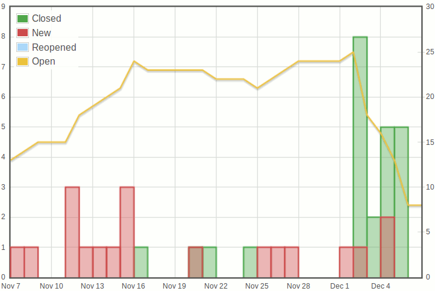

TracSimpleTicketStatsPlugin
===========================

A Trac_ plugin for a macro to display nice configurable graphs of ticket
statistics on Trac_ wiki pages.

- Highly customizable for subsets of tickets in any project, even having custom fields.
- It doesn't have external dependencies.
- The code is protected against `sql injections`__.
- Permissions can be set to allow only some users or groups to use the macro.

__ http://en.wikipedia.org/wiki/Sql_injections

Usage
-----

Example::

    [[SimpleTicketStats(title=Ticket statistics of last 30 days for current version without need of design decision, days=30, width=600, height=400, version=double-barrelled-shotgun, type=!needs design decision)]]

Fixed parameters
~~~~~~~~~~~~~~~~

title
  A title to be displayed above the graph. Default is `Tickets statistics`.

days
  Number of days from the past (until now) to be displayed. Default is `60`.

width
  Width of the graph in pixels. Default is `600`.

height
  Height of the graph in pixels. Default is `400`.

timezone
  The timezone the data is in the database, possible values are `local` and
  `utc`. Default is `local`.

All the default values of the above parameters can be also specified in
`trac.init` as: `default_title`, `default_days`, `default_width`,
`default_height` and `default_timezone`.

Dynamic parameters
~~~~~~~~~~~~~~~~~~

All other parameters filter ticket whose fields have (or not have) some values. From the example
above:

version=double-barrelled-shotgun
  Only tickets of the version named `double-barrelled-shotgun`

type=!needs design decision
  Only tickets whose type is **not** (!) `needs design decision`

Install
-------

- Download the source__ in the machine where your Trac_ installation is living.
- Execute::

    $ cd /path/to/pluginsource
    $ python setup.py bdist_egg
    $ cp dist/*.egg /path/to/projenv/plugins

__ http://github.com/wikical/TracSimpleTicketStatsPlugin

How to say thank you
--------------------

If you use this software, we would like to ask you in return for our efforts
to promote our project `http://wikical.com`__, for example with a link to it
from your web page. **Thanks in advance!**

__ http://wikical.com

License
-------

::

    Copyright (c) 2013 Ivan F. Villanueva B. <ivan@wikical.com>
    All rights reserved.

    Redistribution and use in source and binary forms, with or without
    modification, are permitted provided that the following conditions
    are met:

     1. Redistributions of source code must retain the above copyright
        notice, this list of conditions and the following disclaimer.
     2. Redistributions in binary form must reproduce the above copyright
        notice, this list of conditions and the following disclaimer in
        the documentation and/or other materials provided with the
        distribution.
     3. The name of the author may not be used to endorse or promote
        products derived from this software without specific prior
        written permission.

    THIS SOFTWARE IS PROVIDED BY THE AUTHOR ``AS IS'' AND ANY EXPRESS
    OR IMPLIED WARRANTIES, INCLUDING, BUT NOT LIMITED TO, THE IMPLIED
    WARRANTIES OF MERCHANTABILITY AND FITNESS FOR A PARTICULAR PURPOSE
    ARE DISCLAIMED. IN NO EVENT SHALL THE AUTHOR BE LIABLE FOR ANY
    DIRECT, INDIRECT, INCIDENTAL, SPECIAL, EXEMPLARY, OR CONSEQUENTIAL
    DAMAGES (INCLUDING, BUT NOT LIMITED TO, PROCUREMENT OF SUBSTITUTE
    GOODS OR SERVICES; LOSS OF USE, DATA, OR PROFITS; OR BUSINESS
    INTERRUPTION) HOWEVER CAUSED AND ON ANY THEORY OF LIABILITY, WHETHER
    IN CONTRACT, STRICT LIABILITY, OR TORT (INCLUDING NEGLIGENCE OR
    OTHERWISE) ARISING IN ANY WAY OUT OF THE USE OF THIS SOFTWARE, EVEN
    IF ADVISED OF THE POSSIBILITY OF SUCH DAMAGE.

`TracSimpleTicketStatsPlugin` includes a version of flot__, see `its
license`__.

__ https://github.com/flot/flot
__ https://github.com/flot/flot/blob/master/LICENSE.txt

This code is more or less inspired on TracTicketGraph__ and
TracTicketStatsPlugin__, see their licenses.

__ https://github.com/csnover/TracTicketGraph
__ http://trac-hacks.org/wiki/TracTicketStatsPlugin

.. _Trac: http://trac.edgewall.org/
